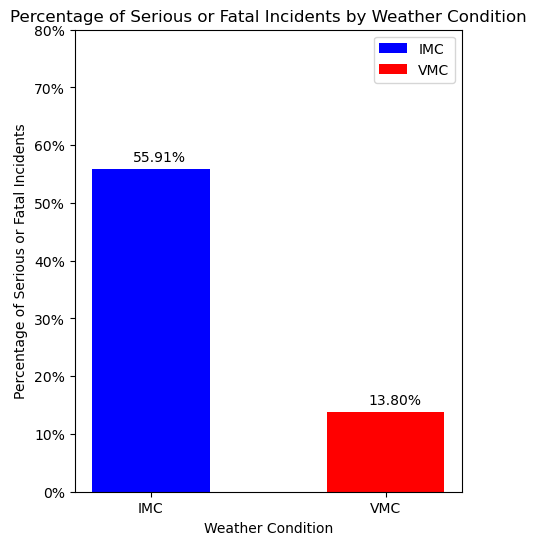
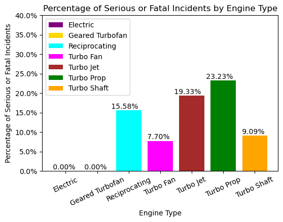

# Organ Transport Aircraft Analysis

## Overview
This project involves analyzing Aircraft Incident data in order to provide stakeholders of my hypothetical business "TransOrgo" with recommendations on which airplanes to purchase."TransOrgo" is a service which provides transportation of organs via airplane for time-sensitive medical operations when the recipient is more than 500 miles away and the biological material is needed within 12-24 hours.

## Business Understanding
- **Key Business Questions:**
    - Which weather conditions are the most risky to fly in?
    - What type of engine should be use?
    - Which type of airplane is least risky for organ transportation, based off the incident data?
    - Which model of airplanes are best for our business?

## Data Understanding and Analysis
- **Source of Data:** Aviation incident data from 1962 to 2023, provided by the National Transportation Safety Board
- **Description of Data:** Aircraft type, incident type (serious, non-fatal, fatal, etc.), location, make, model, weather, build, type of engine, number of engines, and more

- **Visualizations:**
    1. 
    2. 
    3. 

## Conclusion
- **Summary of Conclusions:**
    1. Prices should increase when weather is IMC (low enough visibility in which pilots must soley rely on their instruments)
    2. Airplanes with Turbofan engines are the least risky and should be used
    3. The airplanes purchased should have more than one engine.
 
  ## Links
  - [Tableau Dashboard](https://public.tableau.com/views/Aviation_Phase1_Project_EvanCallaghan/AviationDashboard?:language=en-US&publish=yes&:sid=&:display_count=n&:origin=viz_share_link)
  -  [Google Slides Presentation](https://docs.google.com/presentation/d/1HxlYW66B83pxPG3o0Ia-qink-9bcmr34VuP13UzF6bc/edit?usp=sharing)

